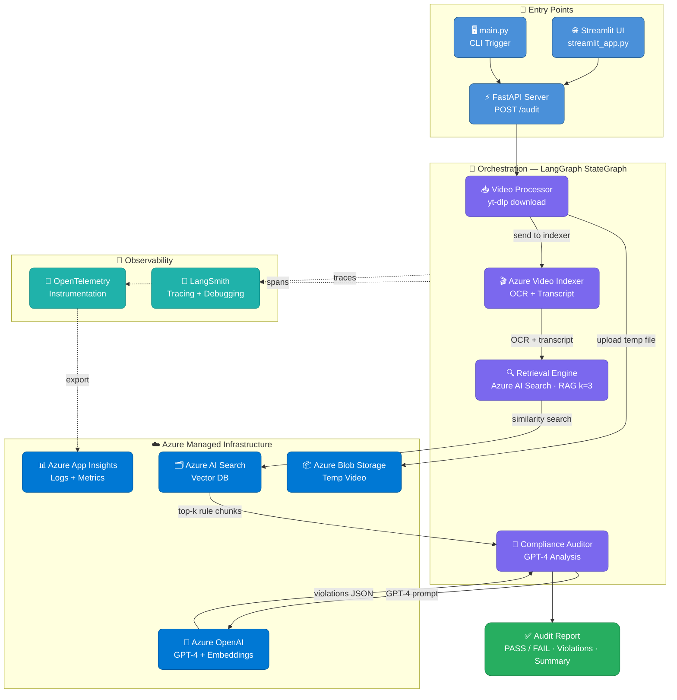

# Azure Multi-modal Compliance Ingestion Engine using LangGraph

An AI pipeline that audits YouTube video ads against brand and regulatory compliance rules. It extracts transcripts and on-screen text via Azure Video Indexer, retrieves relevant rules via RAG from Azure AI Search, and uses GPT-4 to identify violations and generate a structured compliance report.

---

## Architecture



---

## Tech Stack

| Layer | Technology |
|---|---|
| Orchestration | LangGraph (StateGraph) |
| Video Processing | Azure Video Indexer + yt-dlp |
| Compliance Rules Store | Azure AI Search (Vector DB) |
| LLM + Embeddings | Azure OpenAI (GPT-4 + text-embedding) |
| Temp Video Storage | Azure Blob Storage |
| API | FastAPI |
| UI | Streamlit |
| Observability | Azure Application Insights + OpenTelemetry |
| Tracing | LangSmith |

---

## Pipeline Flow

1. **Input** — User submits a YouTube URL via Streamlit UI or `POST /audit`
2. **Download** — `yt-dlp` downloads the video locally as a temp file
3. **Index** — Video is uploaded to Azure Video Indexer, which extracts transcript (speech-to-text) and OCR (on-screen text)
4. **Retrieve** — Transcript + OCR are used to query Azure AI Search for the most relevant compliance rules (RAG, k=3 chunks)
5. **Audit** — GPT-4 receives the transcript, OCR, and retrieved rules, returns structured violations
6. **Output** — PASS/FAIL verdict + list of violations (category, severity, description) + summary report

---

## Project Structure

```
media-compliance-ai/
├── main.py                        # CLI entry point
├── streamlit_app.py               # Streamlit UI
├── backend/
│   ├── src/
│   │   ├── graph/
│   │   │   ├── state.py           # VideoAuditState (shared LangGraph state)
│   │   │   ├── nodes.py           # Indexer node + Auditor node
│   │   │   └── workflow.py        # Graph wiring (indexer → auditor → END)
│   │   ├── services/
│   │   │   └── video_indexer.py   # Azure Video Indexer wrapper
│   │   └── api/
│   │       ├── server.py          # FastAPI — POST /audit, GET /health
│   │       └── telemetry.py       # OpenTelemetry setup
│   └── data/
│       ├── 1001a-influencer-guide-508_1.pdf   # FTC influencer compliance rules
│       └── youtube-ad-specs.pdf               # YouTube ad policy rules
└── azure_functions/               # Azure Functions deployment (planned)
```

---

## Running Locally

### Prerequisites
- Python 3.11+
- Azure subscription with: Video Indexer, AI Search, OpenAI, Blob Storage
- `.env` file with all required keys (see `.env.example`)

### Setup

```bash
# Activate virtual environment
source .venv/Scripts/activate      # Git Bash
.venv\Scripts\activate.ps1         # PowerShell
```

### Start the API server

```bash
uvicorn backend.src.api.server:app --host 0.0.0.0 --port 8000 --reload
```

### Start the UI

```bash
streamlit run streamlit_app.py
```

Open `http://localhost:8501`, paste a YouTube URL, and click **Run Audit**.

---

## Output Format

```json
{
  "status": "FAIL",
  "compliance_results": [
    {
      "category": "FTC Disclosure",
      "severity": "CRITICAL",
      "description": "Sponsored content not disclosed within the first 30 seconds."
    }
  ],
  "final_report": "The video contains one critical violation..."
}
```

---

## Compliance Rules Sources

Rules are indexed into Azure AI Search from:
- **FTC Influencer Guide** — disclosure requirements for sponsored content
- **YouTube Ad Specs & Policies** — platform-level ad compliance rules
